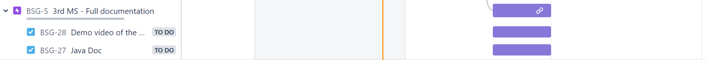

[Javadoc Documentation](https://roiy0987.github.io/Scrabble-Team-W/doc/com.scrabble.bookscrabblegame/module-summary.html)

## Demo Video
[Link to video](https://drive.google.com/file/d/1QPFmpmgjCSpsMmi07Chh2pD74y-pw2Lz/view)

## Scrabble Game:
### _About the game:_

Our project implements the Scrabble game in Java. It is based on the MVVM architectural pattern and enable clients to play using the server (that we created in the lase semester).
The host player and the guest players use the Model to connect with the server in order to progress in the game.
The Model communicates with the server and transfers the functionality of the game from the server to the ViewModel that transfers it to the View.

### _The roles in the game and it's flow:_

* The Book Scrabble Server - The server side is the part of the application that runs on a remote server. It handles the game logic and the communication between the clients.
  The server receives requests from the Model, handles them and return to the Model response, all according to a protocol of their communication.
  Before the game begins, the Model connect to the server by opening a socket, using IP and port addresses.

* The Client Side - The client side is the part of the application that runs on the user's computer. It provides the user with a graphical interface to play the game.
  The client side consist of the Model layer, the ViewModel layer and the View layer. It enables the players to transfer actions and commands to the server.

* The Model - The model represents the state of the game. It contains the board, the tiles, the players, and the score.
  The Model also works as a server of the guest client. They connect to it, send requests and receive responses. The Model connect to the Book Scrabble server.
  It has a protocol of transferring the player's commands (host and guests) to this server and receiving from it answers.
  In addition, the Model updates the ViewModel (it's observer) about changes of the game boards and about answers from the Book Scrabble server.

* The ViewModel - The view model is a mediator between the model and the view. It translates the model state into a format that the view can understand, and vice versa.
  The ViewModel is an observer of the Model. It's also bound by using property data members to the View layer.

* The View - The view is responsible for displaying the game to the user. It renders the board, the tiles, the players, and the score.
  The View is bound by using property data members to the ViewModel layer.

* Player - The Player class is responsible to save the data of the players that might change during the game. The database holds data members such as the Player's socket,
  score and his username.

### _Features:_

This project supports the following features:
* Supports the Scrabble scoring rules using JavaFX (event driven).
* Shows detailed game progress.
* Host mode: 4 players, at least 1 local (game host).
* Guest mode: 1 player.
* validate words against the Scrabble Dictionary.
* Supports the english language.

### _Tasks Subgroups:_
* View - Arik and Tal.
* ViewModel - Roie and Michal.

### _Gannt:_

